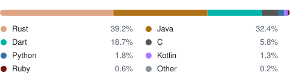

### Hi, I'm Dillon — a.k.a. Molkars 🦆

Quack.

I mostly write **Rust**, plus Java, Dart, and C. Usually parsers, languages, and emulators.

#### Languages

Own repos only, forks and vendored code excluded. <a href="https://molkars.github.io/Molkars/">See the per-repo breakdown →</a>

#### Code I'm proud of

Rotates every few seconds. <a href="https://molkars.github.io/Molkars/code.html">Browse them with captions and source links →</a>

#### Selected projects

- [**pcode-emulator-rs**](https://github.com/Molkars/pcode-emulator-rs) — a P-code emulator written in Rust
- [**dparse**](https://github.com/Molkars/dparse) — a parsing library for Rust, with [derive](https://github.com/Molkars/dparse-derive) and [HTML](https://github.com/Molkars/dparse-html) crates
- [**sea.c**](https://github.com/Molkars/sea.c) — Sea, a simplified C for student instruction
- [**jsl**](https://github.com/Molkars/jsl) — Java Scripting Language
- [**wfc-rust**](https://github.com/Molkars/wfc-rust) — wave-function-collapse in Rust

#### Check these people out

<table>
  <tr>
    <td align="center"><a href="https://github.com/1cg"> <b>Carson Gross</b></a></td>
    <td align="center"><a href="https://github.com/LRitzdorf"> <b>Lucas Ritzdorf</b></a></td>
    <td align="center"><a href="https://github.com/brandan-schmitz"> <b>Fireshade</b></a></td>
  </tr>
  <tr>
    <td align="center"><a href="https://github.com/victoria406"> <b>Victoria White</b></a></td>
    <td align="center"><a href="https://github.com/Jdools05"> <b>jdool</b></a></td>
    <td align="center"><a href="https://github.com/drone29a"> <b>drone</b></a></td>
  </tr>
  <tr>
    <td align="center"><a href="https://github.com/NolanJenko"> <b>Nolan Jenko</b></a></td>
    <td align="center"><a href="https://github.com/mykados"> <b>Mike Kadoshnikov</b></a></td>
    <td align="center"><a href="https://pubs.usgs.gov/publication/pp1842"> <b>Jill Shaffer (USGS)</b></a></td>
  </tr>
</table>
